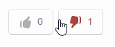

# Kirby Nja

*Version 0.5 - Beta*

**Like or dislike a page for Kirby CMS.**

- All data is stored on your domain, not an external service.
- Spam protection using IP numbers.
- Undo likes/dislikes possible.
- Vanilla js, no jQuery requred.
- It uses an [optimistic UI approach](https://www.smashingmagazine.com/2016/11/true-lies-of-optimistic-user-interfaces/).

*The name "Nja" is Swedish and means "Maybe".*

## Table of contents

- [Installation](docs/installation.md)
- [Setup](docs/setup.md)
- [Methods](docs/methods.md)
- [Hooks](docs/hooks.md)
- [Options](docs/options.md)
- [Changelog](docs/changelog.md)

## Requirements

- [**Kirby**](https://getkirby.com/) 2.4.1+

## Disclaimer

This plugin is provided "as is" with no guarantee. Use it at your own risk and always test it yourself before using it in a production environment. If you find any issues, please [create a new issue](https://github.com/jenstornell/kirby-nja/issues/new).

## License

[MIT](https://opensource.org/licenses/MIT)

It is discouraged to use this plugin in any project that promotes racism, sexism, homophobia, animal abuse, violence or any other form of hate speech.

## Credits

- [Jens Törnell](https://github.com/jenstornell)
- [Daniel Bruce - Entypo thumb icons](http://www.entypo.com)